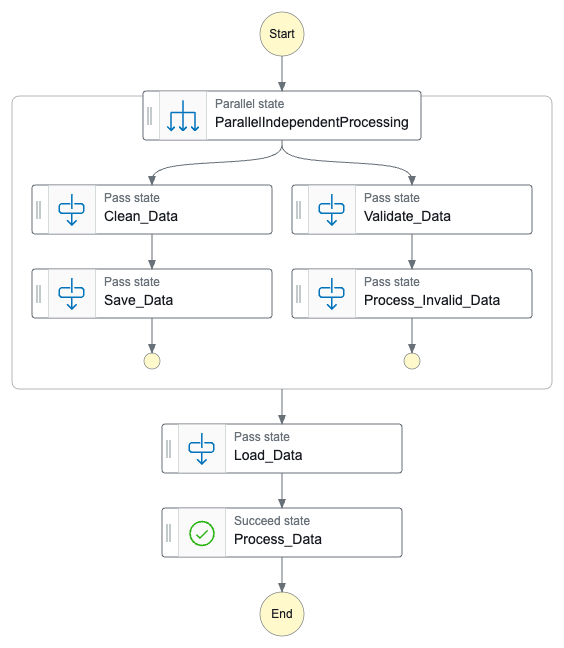
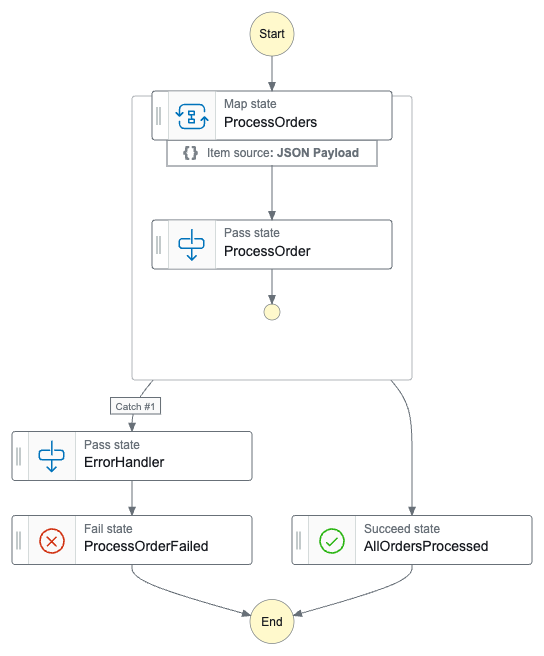
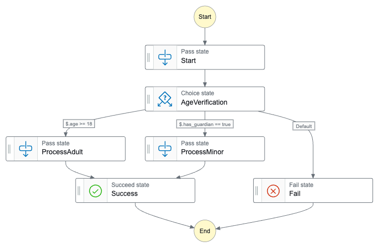
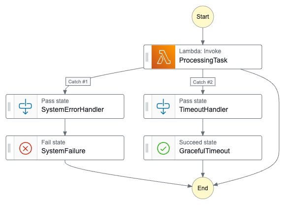

# JSON Integration Statemachine for Orchestration Operations

Jisoo is a Python-based tool for managing AWS Step Functions. It uses Pydantic to ensure valid definitions and integrates with Terraform for a smoother CI/CD workflow. By adopting a configuration-as-code approach, Jisoo simplifies definition management, eliminating the need for lengthy JSON files or manual work in the AWS console, making development more efficient and user-friendly.

# Example Usages

## Smooth CI/CD with Terraform 

This example showcase how to integrate AWS Step Function with terraform for seamless deployment. Ite generate a JSON definition template with placeholders (e.g., `${TO_REPLACE}`) and a corresponding variable list. Users can map there variables and render the final statemachine definition using `templatefile` function. This approach enshires visibility into all required keys, preventing missing configurations.


```python
from jisoo.models.input.terraform import TFVariables
from jisoo.steps import LambdaInvokeStep
from jisoo.models.state import Graph

tfvars = TFVariables
tfvars.add_variable("LAMBDA_FUNCTION_NAME")

lambda_invoke = LambdaInvokeStep(
    function_name=tfvars.get("LAMBDA_FUNCTION_NAME"),
    id="invoke_lambda_example",
    integration_pattern="waitForTaskToken",
    integration_type="optimized",
    payload={
        "TASK_TOKEN.$": "$$.Task.Token",
    }
)

graph = Graph(branch=lambda_invoke)
tfvars.dump_keys("TFKEY_PATH")
with open("DEFINITION_PATH", "w") as f:
    f.write(graph.definition)

```
## Automating Step Functions with DynamoDB Context Injection

This example shows how to dynamically query values from DynamoDB and inject them into a statemachine definition. By leveraging this approach, your workflow always uses the latest contextual without manual updates. Eliminate the need to manage infrastructure changes.

### Table Structure
### Table Structure

| Attribute  | Type   | Key Type       | Description |
|------------|--------|---------------|-------------|
| `resource` | String | Partition Key  | Represents the unique identifier for the resource. |
| `env`      | String | Sort Key       | Specifies the environment (e.g., `dev`, `staging`, `prod`). |
| `metadata` | String | Attribute      | Stores additional metadata as a JSON string or plain text. |


```python
from jisoo.table.dynamodb import DynamoDBTable
from jisoo.steps import LambdaInvokeStep
from jisoo.models.state import Graph

ddb = DynamoDBTable(
    table_name=TABLE_NAME,
    region_name=REGION,
    hash_key="TEST",
    attribute_to_get="metadata",
)

lambda_invoke = LambdaInvokeStep(
    function_name=ddb.get("LAMBDA_FUNCTION_NAME"),
    id="invoke_lambda_example",
    integration_pattern="waitForTaskToken",
    integration_type="optimized",
    payload={
        "TASK_TOKEN.$": "$$.Task.Token",
    }
)

graph = Graph(branch=lambda_invoke)
with open("DEFINITION_PATH", "w") as f:
    f.write(graph.definition)
```

# State

## Parallel

The Parallel state allows you to execute multiple branches of tasks concurrently, enabling efficient processing of independent workflows. This is particularly useful in scenarios where tasks do not depend on each other and can be executed simultaneously, such as data processing, order handling, or any situation where multiple operations can occur in parallel. 

### Example

In the provided example `examples/parallel_processing.py`, we demonstrate a data processing pipeline that utilizes the Parallel state to handle independent tasks such as cleaning, transforming, and validating data concurrently. 



## Map

The Map state allows you to process a collection of items in parallel, applying the same processing logic to each item. This is particularly useful for scenarios where you need to perform the same operation on multiple inputs, such as processing a list of orders, sending notifications, or transforming data.

### Example

In the context of order processing, the Map state enables efficient handling of multiple orders simultaneously. 





## Choice

The Choice state adds branching logic to your state machine. It allows you to make decisions based on input data and direct the workflow down different paths.

### Example

This example `examples/age_verification.py` demonstrates a simple age verification workflow that:
- Allows adults (age >= 18) to proceed directly
- Allows minors with guardians to proceed through a different path
- Rejects all other cases




## Retry & Catch

The Retry and Catch states provide robust error handling capabilities in your state machine. They allow you to gracefully handle failures and implement resilient workflows.

### Retry

Retry allows you to automatically retry failed states using different backoff strategies. This is particularly useful for handling transient failures.

### Catch

Catch handles errors that occur in a state, allowing you to implement fallback logic or custom error handling paths.

### Example

Here's an example `examples/error_handling.py` that demonstrates both Retry and Catch patterns in a task that processes data:


